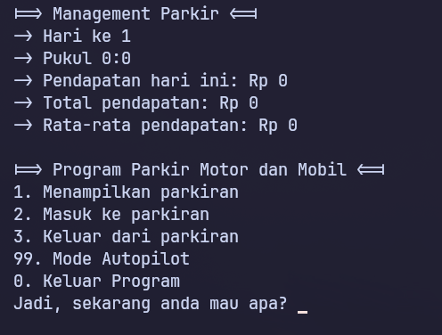

# Tugas Besar Alpro

Program Parkir Kendaraan (Motor dan Mobil)  
-> Parkir Masuk (motor)  
-> Parkir Masuk (mobil)  
-> Keluar (Motor)  
-> Keluar (Mobil)  
-> Hitung ketersediaan parkir (Mobil)  
-> Hitung ketersediaan parkir (Motor)   
Nilai tambahan:  
-> berapa revenue dari tanggal sampai tanggal tertentu  

Buat Program, dalam bahasa C / C++, yang mengimplementasikan materi perkuliahan dari pertemuan 1 hingga 14. Program dibuat secara per kelompok (1 kelompok = 3 mahasiswa), dan dipresentasikan dengan cara direkam. Rekaman presentasi diupload ke media sosial youtube.

Yang dikumpulkan ke e-Learning / edLink adalah link youtube tersebut.
